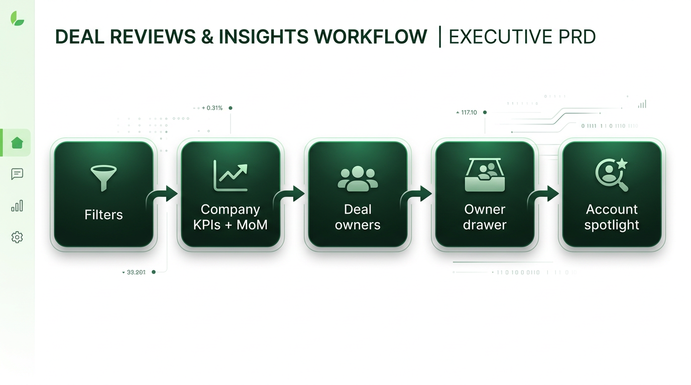
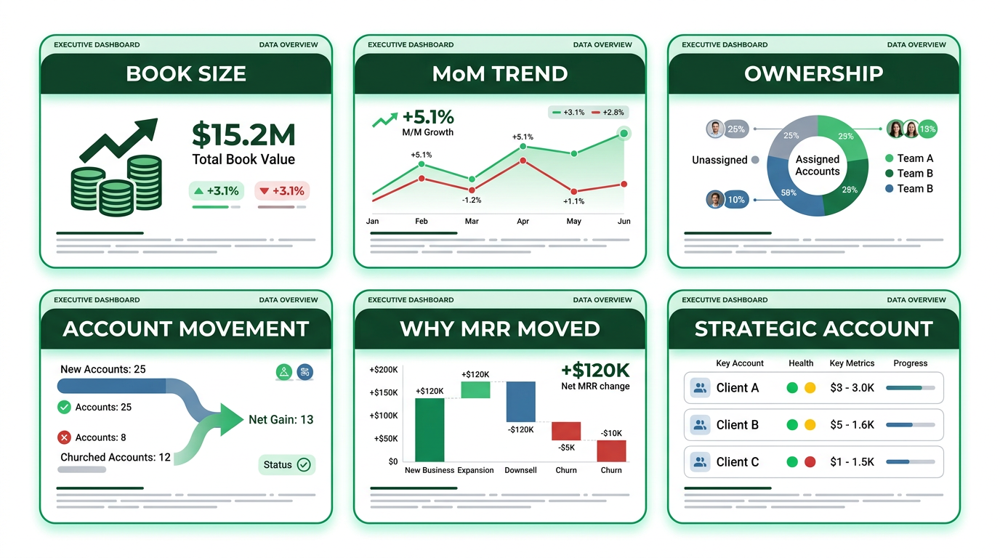
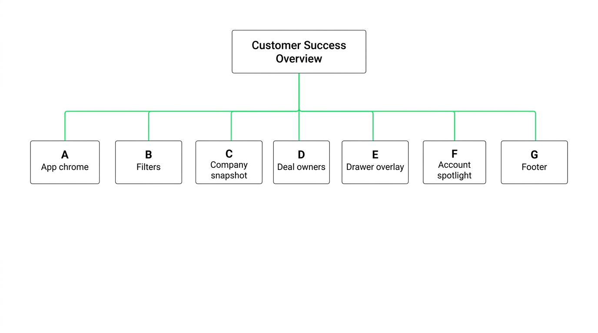
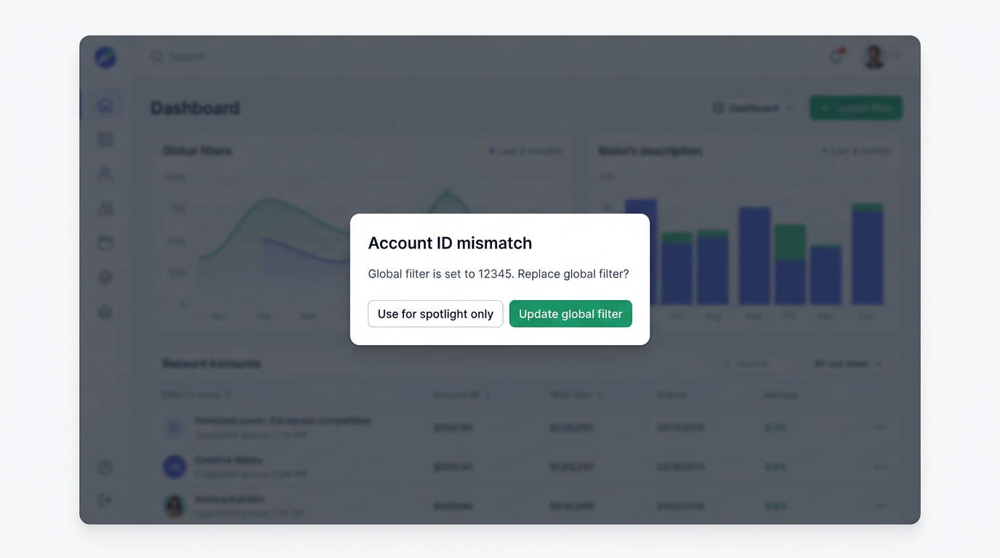
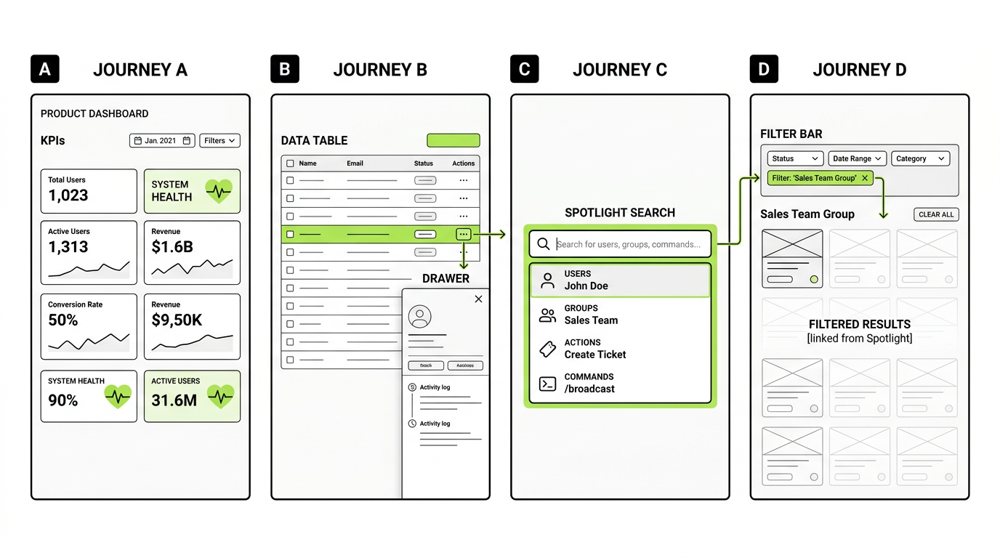
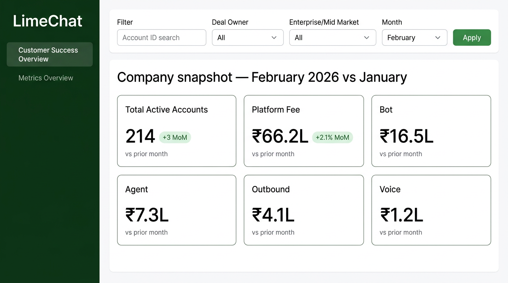
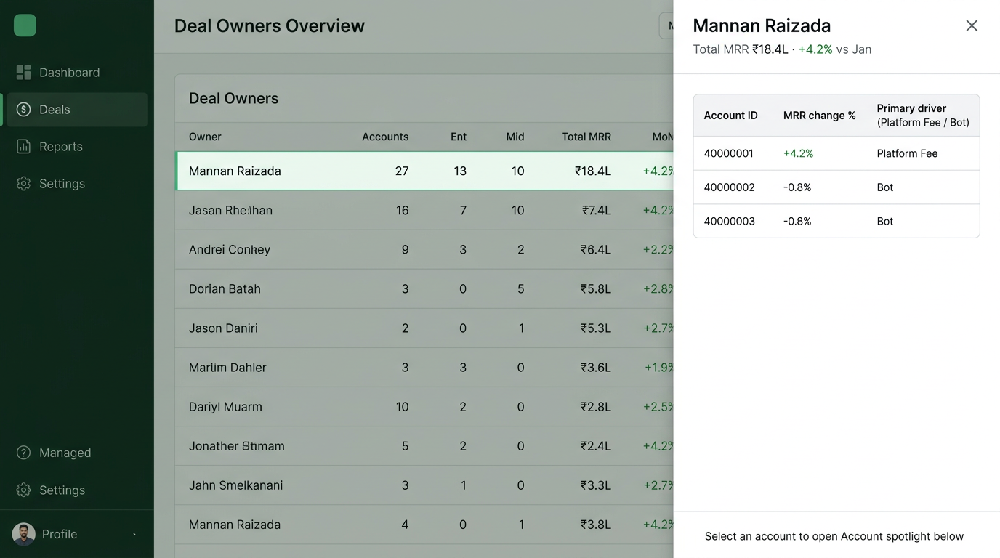
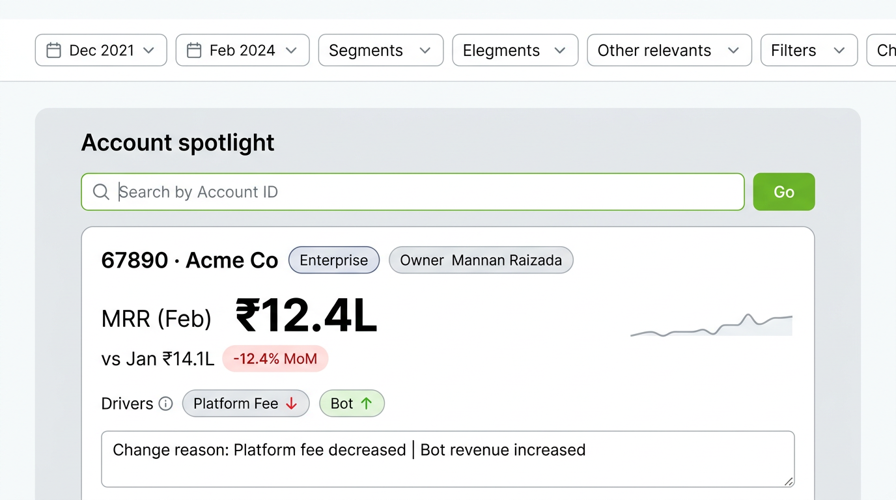
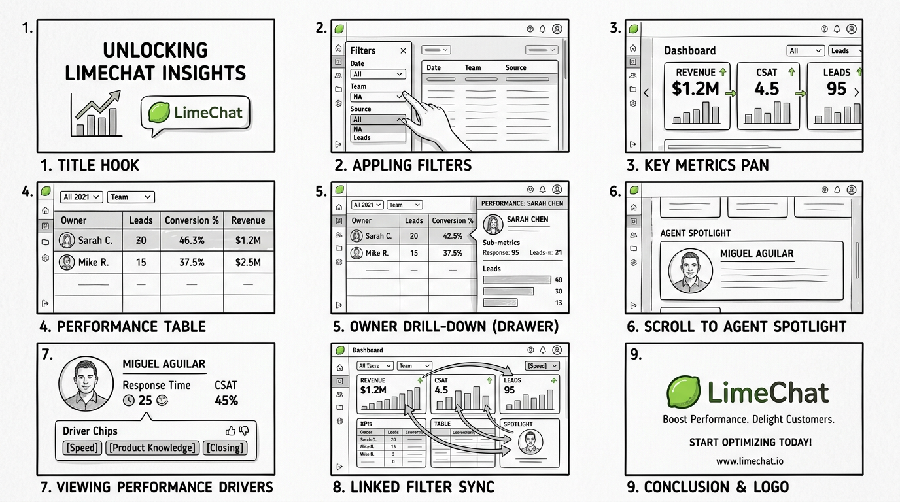

# PRD: Customer Success Executive Dashboard

**Version:** 1.1  
**Owner:** Product & Design  
**Audience:** Engineering, Design, Analytics (Metabase), Video / Comms (explainer)  
**Status:** Approved for build & video production (pending Metabase card IDs where noted)

---

## Document control

| Version | Date | Summary |
|---------|------|---------|
| 0.1 | — | Initial mocks + backlog seeds |
| 1.0 | — | First-principles IA, resolved decisions, single-video spec, no loose ends |
| 1.1 | — | Embedded diagram mocks per section; PDF export + render script |

---

## 1. Executive summary

This PRD defines a **Customer Success Executive** experience in the existing Next.js dashboard: **global filters** → **company snapshot (KPIs + MoM)** → **deal owner performance** → **owner drawer (account-level drivers)** → **Account Spotlight (single-account narrative)**. All quantitative metrics are fetched from **Metabase**; the application owns **state, layout, accessibility, and motion**.

A **single explainer video** (spec in [Section 12](#12-single-explainer-video-specification)) walks a first-time executive through the full flow in one continuous story.

**Visual — end-to-end flow (reference mock)**



---

## 2. First principles: what the business must answer

| Fundamental question | Why it matters | Primary surface in UI |
|----------------------|----------------|------------------------|
| **How big is the CS book right now?** | Baseline for planning | Company KPI strip — Active Accounts + revenue streams |
| **Are we growing or shrinking vs last month?** | Executive pulse | MoM deltas on every KPI + optional summary band |
| **Who owns outcomes?** | Accountability | Deal Owner table (ranking, totals, MoM) |
| **Which accounts moved under an owner?** | Coaching / rescue | Owner drawer — per-account rows |
| **Why did MRR move?** | Actionability | Driver columns + change reason (Metabase) |
| **What is happening on one strategic account?** | Deep dive without re-filtering the whole world | Account Spotlight |

If a proposed UI element does not map to one of these questions, it is **out of scope** for v1 unless promoted via amendment.

**Visual — first-principles map (six questions → surfaces)**



---

## 3. Information architecture (complete tree)

Every subsection below is **intentional**; names are stable for engineering and video narration.

```
Customer Success Overview (route / tab)
│
├── A. App chrome (persistent)
│   ├── A1. Brand / sidebar navigation
│   └── A2. Tab: Customer Success Overview | Metrics Overview (existing)
│
├── B. Global filter bar (sticky below header)
│   ├── B1. Account ID — search / typeahead (optional: debounced)
│   ├── B2. Deal Owner — single-select from fixed list + “All”
│   ├── B3. Enterprise / Mid Market — single-select + “All”
│   ├── B4. Month — January | February | … (extensible)
│   └── B5. Apply — commits filter state to all dependent Metabase calls
│
├── C. Company snapshot (section)
│   ├── C1. Section title — e.g. “Company snapshot — {Month} {Year} (vs {Prior month})”
│   ├── C2. KPI strip (six tiles, single row on desktop; wrap on small screens)
│   │   ├── C2a. Total Active Accounts (+ MoM where defined)
│   │   ├── C2b. Contract revenue — Platform fee (+ MoM)
│   │   ├── C2c. Contract revenue — Bot (+ MoM)
│   │   ├── C2d. Contract revenue — Agent (+ MoM)
│   │   ├── C2e. Contract revenue — Outbound (+ MoM)
│   │   └── C2f. Contract revenue — Voice (+ MoM) [feature-flagged until Metabase card exists]
│   └── C3. Optional: “Net movement” one-liner (if Metabase exposes aggregate bridge)
│
├── D. Deal owner performance (section)
│   ├── D1. Section title + short helper text (“Click a row to see accounts”)
│   ├── D2. Data table — sortable columns (min: Owner, Accounts, Enterprise count, Mid-Market count, Total MRR or CS revenue, MoM %)
│   └── D3. Row interaction — click opens **Owner detail drawer** (D4)
│
├── E. Owner detail drawer (overlay; not a separate route in v1)
│   ├── E1. Header — Owner name; total MRR (or defined headline metric); MoM vs prior month
│   ├── E2. Sub-table — one row per account: Account ID, Account name (if available), MRR change, % , primary driver, truncated reason
│   ├── E3. Row action — “View in Account Spotlight” (sets Spotlight + scrolls)
│   └── E4. Close — returns focus to table; selection state may persist for video/deep link
│
├── F. Account Spotlight (section; same page, below D)
│   ├── F1. Section title + helper (“Deep dive on one account”)
│   ├── F2. Search — Account ID input + submit (and optional recent accounts)
│   ├── F3. Detail card — headline MRR, prior month, MoM %, trend label
│   ├── F4. Driver breakdown — platform / bot / agent / outbound / voice (as data allows)
│   ├── F5. Change reason — full text from Metabase
│   └── F6. Empty / error / loading states (explicit copy in Section 8)
│
└── G. Footer / meta (optional v1)
    └── G1. Data freshness string if Metabase returns `updated_at` or build time
```

**Visual — IA tree (sections A–G)**



---

## 4. Product decisions (previously ambiguous — now locked)

These remove “loose ends” for engineering and script writing.

| Topic | Decision | Rationale |
|-------|----------|-----------|
| **MoM definition** | **Calendar month vs immediate prior month** in the same year: e.g. February vs January. **January** compares to **December of the prior year**. | Aligns with finance month close; implement in Metabase SQL. |
| **Global Account ID vs Account Spotlight** | **Linked default:** When **B1 Account ID** is non-empty **after Apply**, **Account Spotlight (F)** automatically loads that account’s detail (same Metabase query as manual search). When **B1 is empty**, Spotlight is **independent** (user can explore any account without narrowing global KPIs). If user clears B1, Spotlight **retains last loaded account** until user clears Spotlight explicitly. | One mental model: filter = “whole dashboard lens”; Spotlight when no filter = “sidecar deep dive.” |
| **Conflict: user types different ID in Spotlight while B1 is set** | On Spotlight **Submit**, show **inline warning**: “Global filter is set to {id}. Replace global filter?” **Actions:** [Use for spotlight only] (temporary override for F only) or [Update global filter] (sets B1 and re-Apply). | Prevents silent inconsistency. |
| **Voice revenue tile** | Behind **`NEXT_PUBLIC_VOICE_REVENUE_ENABLED`** (or server env). **Off:** tile hidden. **On:** requires `METRICS_CONFIG` card ID. | Ship UI before analytics finalizes card. |
| **Outbound in summary** | If summary card omits outbound, **continue** using dedicated Metabase card for outbound tile (existing pattern). | Data accuracy over single-query convenience. |
| **URL / sharing** | Support `?month=&deal_owner=&account_id=` for **filter bar**; `?spotlight=` optional for Account Spotlight account id. Document in README. | Shareable executive links. |
| **Accessibility** | MoM **must** include text: “Up 4.2%” not only green color. | WCAG-aligned. |

**Visual — Spotlight vs global filter conflict (Section 4, conflict row)**

When the user submits a different Account ID in Account Spotlight while **B1** is set, this modal pattern applies.



---

## 5. Personas & primary jobs

| Persona | Job | Success in this dashboard |
|---------|-----|----------------------------|
| **CS leadership** | See book health and trend | C + MoM at a glance |
| **RevOps / Finance** | Reconcile segments and month | B filters + C consistency |
| **Deal owner (manager)** | See team and accounts | D + E |
| **Account manager** | Explain one customer | F |

**Visual — persona → section mapping**

Personas align to IA sections **C–F** as in the table above (leadership → C; RevOps → B+C; deal owner → D+E; account manager → F).

---

## 6. User journeys (acceptance-level)

### 6.1 Journey A — Executive pulse (60 seconds)

1. Land on Customer Success Overview.  
2. See **B** with defaults (e.g. Month = latest available, others All).  
3. See **C** KPIs populate with **MoM** labels.  
4. **Done** when user can state “up/down” for the book without scrolling.

### 6.2 Journey B — Owner accountability

1. User scans **D**, sorts by MoM or MRR.  
2. Clicks one owner → **E** opens.  
3. Reads **E2** for worst/best accounts.  
4. **Done** when user identifies accounts to coach.

### 6.3 Journey C — Account narrative

1. User opens **F**, enters Account ID, submits.  
2. Sees **F3–F5** with drivers and reason.  
3. **Done** when user can explain MRR movement to a customer or exec.

### 6.4 Journey D — Filter + spotlight linked

1. User sets **B1** Account ID, **Apply**.  
2. **C** and **D** reflect filtered universe; **F** auto-loads same account.  
3. **Done** when numbers match Metabase for that filter set.

**Visual — four acceptance journeys (A–D)**



---

## 7. Functional requirements

| ID | Requirement | Acceptance |
|----|-------------|------------|
| FR-01 | Filter state includes `account_id`, `deal_owner`, `enterprise_midmarket`, `month` | All documented Metabase tags receive values per `metrics-config` |
| FR-02 | Apply commits state; dependent queries refetch | No stale mix of old/new filters |
| FR-03 | Company KPI strip shows six streams + Active Accounts | Layout per Section 3C |
| FR-04 | Each KPI shows value + MoM fields when Metabase returns them | Fallback: hide MoM chip if null |
| FR-05 | Deal owner table sortable | At least one numeric column sort |
| FR-06 | Row click opens drawer **E** with correct owner | Correct Metabase `deal_owner` param |
| FR-07 | Drawer lists accounts with driver + reason columns | Column map in analytics contract |
| FR-08 | “View in Spotlight” from drawer | Sets Spotlight account, scrolls to **F** |
| FR-09 | Account Spotlight search loads Metabase detail | Loading/error/empty states |
| FR-10 | Linked behavior Section 4 | Automated tests or QA checklist |
| FR-11 | Conflict flow Section 4 | Warning + two actions |
| FR-12 | URL params sync optional | Documented query keys |
| FR-13 | Voice tile gated by env | No runtime error if disabled |

**Visual** — See **Section 11** for UI mocks (C–F) and PRD diagrams; functional scope maps to tiles and tables shown there.

---

## 8. States & copy (no ambiguous empty UX)

| State | Surface | User-facing copy (draft) |
|-------|---------|----------------------------|
| Loading | C, D, E, F | “Loading…” / skeletons |
| No permission / API error | Global | “Unable to load metrics. Try again.” |
| No data (valid filters) | Table | “No accounts match these filters.” |
| Spotlight empty | F | “Enter an Account ID to see MRR, trend, and change drivers.” |
| Spotlight not found | F | “No data for this account in the selected month.” |
| MoM N/A | KPI | Omit chip or “—” with tooltip “Prior month unavailable” |

**Visual** — Loading and empty states apply to the same surfaces as **Section 11.1** (KPI strip, owner table, drawer, Spotlight).

---

## 9. Data & Metabase contract

- **Source of truth:** Metabase questions; version card IDs in `lib/metrics-config.ts`.  
- **MoM:** Computed in SQL per Section 4; app does not invent deltas except for display formatting.  
- **Granularity matrix:**

| Surface | Typical grain | Tags |
|---------|---------------|------|
| C | Company aggregate | month, optional segment filters |
| D | Deal owner | month, deal_owner?, enterprise?, account? |
| E | Account under owner | deal_owner, month, … |
| F | Single account | account_id, month |

- **Analytics deliverable:** Named questions + template tags documented in repo README or `docs/metabase-contract.md` (recommended follow-up artifact).

---

## 10. Non-functional

- **Performance:** Initial meaningful paint < 3s on office network; parallelize independent Metabase calls where possible.  
- **Security:** No secrets in client; existing API route pattern.  
- **Telemetry (optional):** Section expand, drawer open, spotlight submit (privacy-safe).

---

## 11. Static reference mocks (UI + PRD diagrams)

### 11.1 Screen-level UI mocks (implementation reference)

| File | IA | Purpose |
|------|-----|---------|
| `cs-mock-01-company-overview.png` | B + C | Global filter bar + company KPI strip |
| `cs-mock-02-deal-owner-drawer.png` | D + E | Deal owner table + owner detail drawer |
| `cs-mock-03-account-spotlight.png` | F | Account Spotlight deep dive |







### 11.2 PRD diagram mocks (Sections 1–6 & 12)

| File | Section | Purpose |
|------|---------|---------|
| `prd-mock-01-exec-flow.png` | 1 | Executive flow diagram |
| `prd-mock-02-first-principles.png` | 2 | Six questions infographic |
| `prd-mock-03-ia-tree.png` | 3 | IA tree A–G |
| `prd-mock-04-conflict-modal.png` | 4 | Conflict UX |
| `prd-mock-05-user-journeys.png` | 6 | Journeys A–D storyboard |
| `prd-mock-06-video-storyboard.png` | 12 | Nine-scene video grid |

---

## 12. Single explainer video (specification)

**Deliverable:** One **MP4** (or hosted link) between **90 and 120 seconds**, **16:9**, **1080p minimum**, voiceover + on-screen labels. **This repository does not ship a rendered video file**; Design / Comms produces it using this shot list.

**Tone:** Calm, executive, no jargon beyond “month over month” and “deal owner.”

**Music:** Optional, low under voice; not required.

**Visual — nine-scene storyboard (maps to table 12.1)**



### 12.1 Video structure (one continuous flow)

| Scene | Duration (s) | Visual | Voiceover (guide script) | On-screen text |
|-------|----------------|--------|---------------------------|----------------|
| **1. Hook** | 0–8 | LimeChat product frame; dashboard tab highlighted | “This is the Customer Success Executive view—one place to see revenue health, ownership, and account-level change.” | Title: **Customer Success Overview** |
| **2. Filters** | 8–22 | Cursor highlights B1–B5; user changes Month; clicks Apply | “Start with filters: account, deal owner, segment, and month. Apply runs the whole story.” | Labels: **Filters** |
| **3. Company snapshot** | 22–42 | Pan across C2a–C2f; MoM chips animate in | “Here is the company snapshot—active accounts and every major revenue line, each with month-over-month movement.” | **Company snapshot** |
| **4. Deal owners** | 42–58 | Scroll to D; highlight column headers; sort | “See which deal owners carry the book and how their portfolio moved.” | **Deal owner performance** |
| **5. Drawer** | 58–78 | Click row; E slides in; highlight E1 then E2 | “Click an owner to open the detail drawer—total MRR for that owner, then every account underneath with the driver of change.” | **Owner detail** |
| **6. To Spotlight** | 78–92 | Click “View in Account Spotlight” or account row; scroll to F | “From here, jump straight to Account Spotlight—a dedicated readout for one account.” | **Account Spotlight** |
| **7. Spotlight detail** | 92–108 | F3–F5 visible; driver chips | “MRR, prior month, the percent change, what drove it—platform, bot, agent, outbound, voice—and the written reason.” | **Drivers · Reason** |
| **8. Linked filter** | 108–118 | Set B1 Account ID, Apply; F auto-loads | “When you filter by account globally, Spotlight stays in sync—same account, full context.” | **Filters ↔ Spotlight** |
| **9. Close** | 118–120 | Fade to logo | “Customer Success Overview—track the book, the owners, and every account story.” | **LimeChat** |

**Total:** ~120s (trim scenes 3 or 7 by 5s each if a strict 90s cut is required).

### 12.2 Motion design (for editor / motion designer)

- **Transitions:** 200–250ms ease-out; no elastic easing.  
- **Scene 3:** KPI tiles stagger 50ms; MoM chips fade after values count (optional 300ms).  
- **Scene 5:** Drawer slide from right; backdrop 40% black.  
- **Scene 6:** Scroll uses smooth scroll; optional 200ms highlight pulse on **F** container.  
- **Lower-thirds:** Single font family; green accent matches app sidebar.

### 12.3 Acceptance criteria (video)

- [ ] All sections **A–F** appear in order; none skipped.  
- [ ] Narration matches locked decisions (Section 4), especially **Spotlight ↔ global filter**.  
- [ ] No promise of features not in PRD (e.g. mobile app, real-time).  
- [ ] Captions file (SRT) delivered for accessibility.

---

## 13. Success metrics (product)

- Time to answer “Are we up or down MoM?” < **30s** for new user (usability test).  
- **≥80%** of pilot users locate Account Spotlight without prompt after watching video once.

---

## 14. Risks & mitigations

| Risk | Mitigation |
|------|------------|
| Metabase latency | Skeletons, parallel fetch, cache policy per API route |
| Incomplete MoM in SQL | FR-04 fallback; analytics backlog |
| Filter complexity | Section 4 conflict UX; user testing on **F** |

---

## 15. Glossary

| Term | Definition |
|------|------------|
| **MoM** | Month-over-month vs prior calendar month per Section 4 |
| **Deal owner** | Hubspot / internal owner field; list is curated in UI |
| **Driver** | Primary attributed revenue component for MRR change |
| **Account Spotlight** | Section F; single-account narrative |

---

## 16. Appendix: explainer asset checklist for Comms

- [ ] Final screen recording or high-res export from staging  
- [ ] Voiceover WAV + SRT  
- [ ] Cover thumbnail (16:9)  
- [ ] Upload target (Loom / Drive / internal wiki) linked from README optional

---

## 17. PDF export

- **Built PDF:** [`PRD-customer-success-executive-dashboard.pdf`](PRD-customer-success-executive-dashboard.pdf) (generated from this Markdown; images load from `cs-dashboard-mocks/`.)
- **Regenerate:** from repo root, run: `python3 docs/render-prd-pdf.py` (requires **Google Chrome** for headless print; also writes `PRD-customer-success-executive-dashboard.html`).
- **Mermaid:** flowcharts in this doc render as monospace fallbacks in PDF; use the live Markdown preview in an editor that supports Mermaid for diagrams.

---

*End of PRD v1.1*
